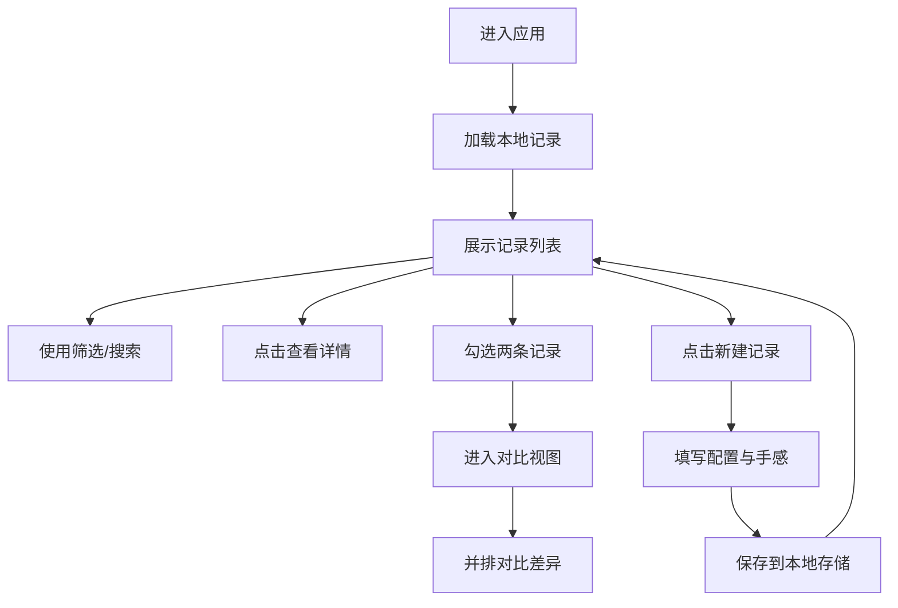

## 1. 产品概述

键盘手感日志是一款面向机械键盘爱好者的记录与对比工具，帮助玩家系统化地记录每把键盘的配置组合与主观手感体验，并通过多维度筛选和并排对比功能，做出更明智的购置决策。

- 目标用户：机械键盘发烧友、客制化键盘玩家、键盘评测爱好者
- 核心价值：沉淀个人手感数据库、量化主观体验、辅助配置决策

## 2. 核心功能

### 2.1 用户角色
| 角色 | 注册方式 | 核心权限 |
|------|---------|---------|
| 普通用户 | 无需注册（本地存储） | 创建/编辑/删除记录、筛选浏览、对比查看 |

### 2.2 功能模块
1. **日志列表页**：记录卡片列表、多条件筛选、搜索、排序
2. **记录表单**：新建/编辑键盘手感记录的完整表单
3. **详情视图**：单条记录的详细展示
4. **对比视图**：两把键盘配置与手感的并排对比

### 2.3 页面详情
| 页面名称 | 模块名称 | 功能描述 |
|---------|---------|---------|
| 日志列表 | 顶部导航 | 品牌标识、新建记录按钮、视图切换（列表/对比） |
| 日志列表 | 筛选栏 | 轴体类型筛选、声音倾向筛选、评分筛选、搜索框 |
| 日志列表 | 记录卡片 | 缩略展示键盘配置摘要、评分、标签，支持点击查看详情、勾选加入对比、删除 |
| 记录表单 | 基础信息 | 键盘名称、品牌/型号、入手日期、整体评分（1-10） |
| 记录表单 | 硬件配置 | 轴体（名称/类型/数量/润滑情况）、键帽（材质/高度/工艺）、定位板（材质/厚度）、填充材料（种类/层数）、外壳材质 |
| 记录表单 | 手感描述 | 声音描述（低沉/清脆/闷响/响亮等）、回弹感评分、段落感评分、打字疲劳程度（1-10）、文字备注、声音标签 |
| 对比视图 | 选择区 | 选择两把键盘进行对比、快速交换位置 |
| 对比视图 | 对比面板 | 双列并排展示所有配置项与手感指标，差异高亮 |

## 3. 核心流程

用户打开应用 → 浏览已有记录列表 → 通过筛选条件缩小范围 → 点击记录查看详情 → 勾选两条记录进入对比视图 → 或点击新建按钮填写表单 → 保存后返回列表

## 4. 用户界面设计

### 4.1 设计风格
- **主色调**：深炭灰 (#1a1a1e) 背景 + 温暖的黄铜橙 (#d4944a) 强调色，体现客制化键盘的精致工业感
- **辅助色**：橄榄绿 (#6b8e5a) 表示好评、酒红 (#a65252) 表示差评、石板蓝 (#5a6b8e) 中性
- **按钮风格**：微圆角 (6px)、轻微内阴影按压效果、悬停时黄铜色边框发光
- **字体**：标题使用 JetBrains Mono（等宽字体呼应机械键盘编码感），正文使用 Inter
- **布局风格**：卡片式网格布局、深色毛玻璃质感面板、像素级间距对齐
- **视觉元素**：键盘键帽形状的装饰元素、微妙的网格背景、轴体触发的微动效

### 4.2 页面设计概览
| 页面名称 | 模块名称 | UI 元素 |
|---------|---------|--------|
| 日志列表 | 顶部导航 | 深色固定栏、Logo 使用键帽图标、黄铜色主按钮 |
| 日志列表 | 筛选栏 | 胶囊式筛选标签组、下拉选择器、滑块评分筛选 |
| 日志列表 | 记录卡片 | 悬停上浮 + 阴影、左上角评分徽章、轴体/键帽/定位板标签色块 |
| 记录表单 | 表单区 | 分组折叠面板、每组分隔线、输入框深色底板 + 焦点高亮 |
| 记录表单 | 评分组件 | 1-10 滑块 + 数字回显、多维度星级条 |
| 对比视图 | 对比面板 | 中间竖向分隔线、差异项背景色标注、相同项淡化显示 |
| 对比视图 | 指标条 | 横向进度条对比评分、不同颜色区分两把键盘 |

### 4.3 响应式设计
- 桌面端优先（1280px 以上），列表采用 3-4 列卡片网格
- 平板端（768-1279px）：2 列卡片、筛选栏横向排列
- 移动端（768px 以下）：单列卡片、筛选栏折叠、对比视图改为上下堆叠
- 所有交互元素确保最小 44px 触控区域
