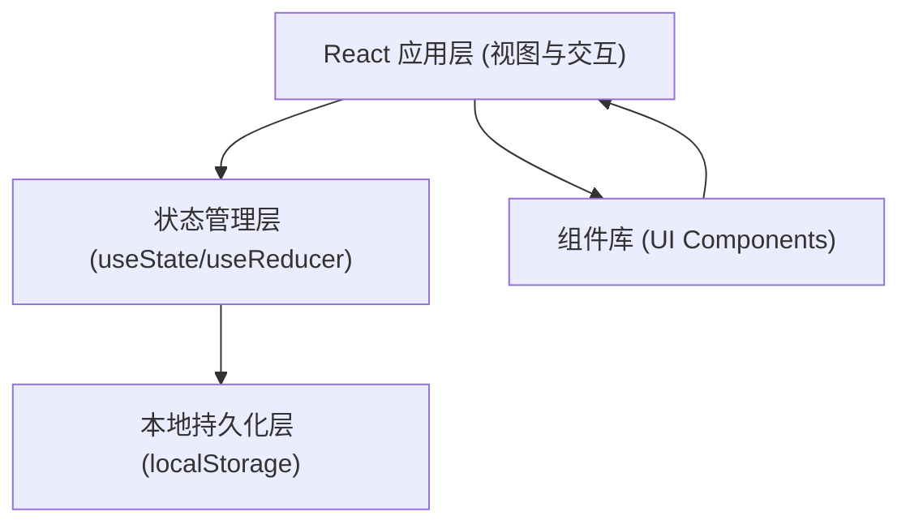
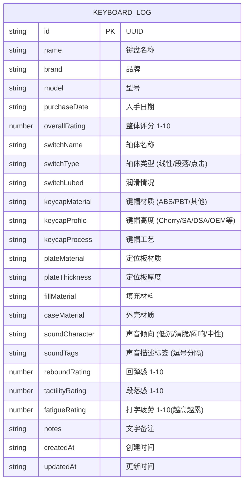

## 1. 架构设计



纯前端单页应用，无后端服务。数据通过 `localStorage` 持久化存储在浏览器本地。

## 2. 技术选型说明

- **前端框架**：React@18 + TypeScript（类型安全，适合复杂表单）
- **构建工具**：Vite@5（快速冷启动、HMR 体验好）
- **样式方案**：TailwindCSS@3 + CSS 变量（快速构建深色工业风 UI）
- **状态管理**：React Hooks（useState + useContext，规模小无需 Redux）
- **图标库**：Lucide React（简洁现代风格，适合深色主题）
- **后端**：无
- **数据库**：localStorage（浏览器本地存储）
- **初始数据**：内置 3-5 条示例记录，方便首次打开即可体验

## 3. 路由定义

单页应用，通过状态切换视图，不使用 react-router：

| 视图 | 触发条件 | 说明 |
|-----|---------|------|
| 列表视图 (ListView) | 默认视图 | 展示所有记录 + 筛选栏 |
| 表单弹窗 (FormModal) | 点击"新建"或卡片"编辑" | 新建或编辑记录 |
| 详情弹窗 (DetailModal) | 点击卡片主体 | 查看单条完整记录 |
| 对比视图 (CompareView) | 勾选 2 条后点击"对比"按钮 | 并排对比两把键盘 |

## 4. 数据模型

### 4.1 实体关系图



### 4.2 数据类型定义 (TypeScript)

```typescript
type SwitchType = 'linear' | 'tactile' | 'clicky' | 'other';
type SoundCharacter = 'deep' | 'bright' | 'muffled' | 'neutral';
type KeycapMaterial = 'ABS' | 'PBT' | 'PC' | '混合' | '其他';
type KeycapProfile = 'Cherry' | 'SA' | 'DSA' | 'OEM' | 'XDA' | 'KAT' | 'MT3' | '其他';
type PlateMaterial = '铝' | '铜' | '钢' | 'PC/FR4' | '碳纤维' | '塑料' | '其他';
type CaseMaterial = '铝合金' | '塑料' | '木头' | '亚克力' | '黄铜' | '不锈钢' | '其他';

interface KeyboardLog {
  id: string;
  name: string;
  brand: string;
  model: string;
  purchaseDate: string;
  overallRating: number;
  switchName: string;
  switchType: SwitchType;
  switchLubed: string;
  keycapMaterial: KeycapMaterial;
  keycapProfile: KeycapProfile;
  keycapProcess: string;
  plateMaterial: PlateMaterial;
  plateThickness: string;
  fillMaterial: string;
  caseMaterial: CaseMaterial;
  soundCharacter: SoundCharacter;
  soundTags: string[];
  reboundRating: number;
  tactilityRating: number;
  fatigueRating: number;
  notes: string;
  createdAt: string;
  updatedAt: string;
}

interface FilterState {
  switchType: SwitchType | 'all';
  soundCharacter: SoundCharacter | 'all';
  minRating: number;
  searchKeyword: string;
}
```

## 5. 组件结构

```
src/
├── components/
│   ├── layout/
│   │   └── Header.tsx            # 顶部导航栏
│   ├── list/
│   │   ├── FilterBar.tsx         # 筛选栏
│   │   ├── KeyboardCard.tsx      # 记录卡片
│   │   └── ListView.tsx          # 列表视图容器
│   ├── form/
│   │   ├── RatingSlider.tsx      # 评分滑块组件
│   │   ├── Section.tsx           # 表单分组折叠面板
│   │   ├── TagInput.tsx          # 标签输入组件
│   │   └── FormModal.tsx         # 新建/编辑表单弹窗
│   ├── detail/
│   │   └── DetailModal.tsx       # 详情弹窗
│   └── compare/
│       ├── CompareSelect.tsx     # 对比选择区
│       ├── CompareRow.tsx        # 单行对比项
│       └── CompareView.tsx       # 对比视图容器
├── hooks/
│   ├── useLocalStorage.ts        # localStorage Hook
│   └── useKeyboardData.ts        # 键盘数据 CRUD Hook
├── types/
│   └── index.ts                  # TypeScript 类型定义
├── data/
│   └── sampleData.ts             # 示例数据
├── utils/
│   └── helpers.ts                # 辅助函数
├── App.tsx                       # 应用根组件
├── main.tsx                      # 入口文件
└── index.css                     # 全局样式 + Tailwind 指令
```

## 6. 核心实现要点

1. **数据持久化**：自定义 Hook 封装 localStorage 读写，JSON 序列化处理
2. **筛选逻辑**：组合条件过滤（轴体类型 AND 声音倾向 AND 评分 ≥ 最小值 AND 关键词模糊匹配）
3. **对比差异高亮**：逐字段比较两个对象，值不同则添加高亮样式类
4. **评分可视化**：自定义 Range 滑块 + 数字回显，颜色根据分数渐变
5. **弹窗管理**：通过全局状态控制弹窗类型与数据，使用 Portal 挂载到 body
6. **动效设计**：卡片悬停 transform + transition、弹窗淡入缩放、筛选标签切换动画
